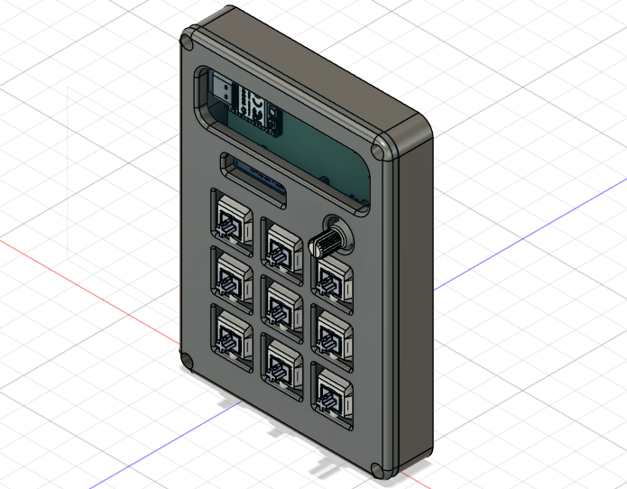
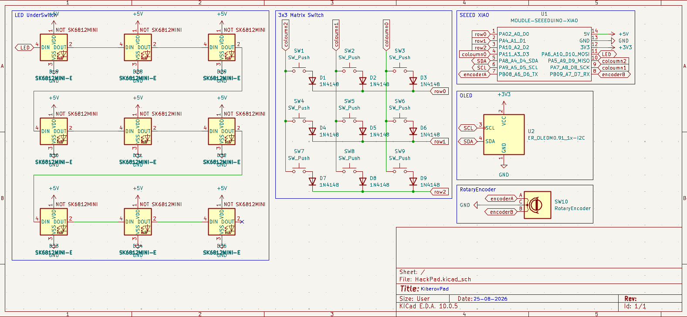
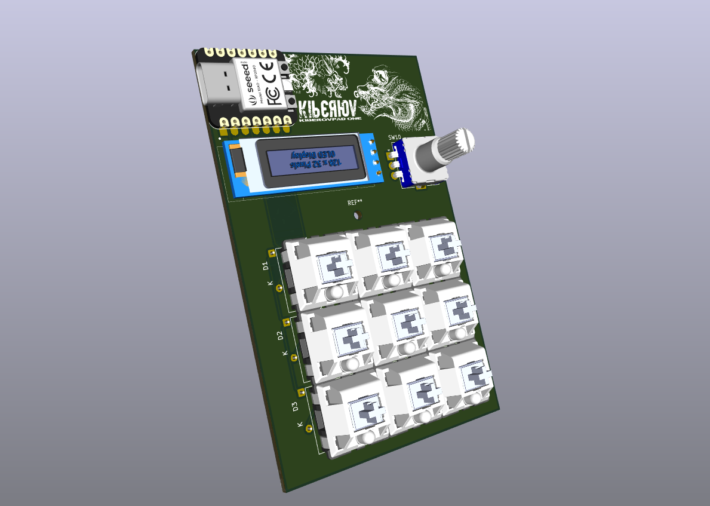

# KiberovPad

KiberovPad is a 3x3 macropad with an EC11 rotary encoder, a 128x32 OLED display, and 9 WS2812B RGB LEDs. It uses an RP2040 and QMK firmware.

I wanted to make a small macropad that I could actually use for shortcuts while also learning more about PCB design, QMK and hardware.

## Features
Custom volume control using the rotary encoder
Custom OLED animation
9 individually addressable RGB LEDs
Programmable keys using QMK
Keyboard shortcuts and macros
Compact 3x3 layout
Custom-designed PCB and case
CAD Model

The case was designed specifically for the KiberovPad PCB.

The goal was to keep it compact while still leaving enough space for the OLED, rotary encoder and RGB LEDs.

Made in Fusion 360.

## Schematic

## PCB
The PCB was designed in KiCad.

The PCB contains the 3x3 switch matrix, RP2040, rotary encoder, OLED connection and RGB LED chain.

## Pinout
Function	GPIO
Row 1	GP2
Row 2	GP3
Row 3	GP4
Column 1	GP5
Column 2	GP8
Column 3	GP9
Encoder A	GP21
Encoder B	GP20
RGB Data	GP10
OLED SDA	GP6
OLED SCL	GP7

## Firmware

KiberovPad uses QMK firmware.

The current keymap includes shortcuts for things like switching tabs, copying, pasting, cutting and moving between workspaces.

The rotary encoder controls system volume.

The OLED runs a custom animation that loops continuously.

The firmware successfully compiles with QMK.

The physical hardware has not been tested yet because the parts have not arrived.

OLED

The OLED uses a custom frame animation.

RGB

The KiberovPad has 9 WS2812B RGB LEDs connected in a chain.

The RGB data line is connected to GP10.

## BOM

Here is the hardware needed to build the KiberovPad:

1x RP2040
9x MX-style mechanical switches
9x keycaps
9x 1N4148 diodes
9x WS2812B LEDs
1x EC11 rotary encoder
1x 128x32 OLED display
1x Custom KiberovPad PCB
1x Custom case
USB-C connector
Required resistors and capacitors
M3 screws / hardware for the case

## Extra Stuff

This started as a project to make my own macropad while learning more about PCB design, QMK and hardware.

It's also my first time properly working with QMK, so I added comments to the firmware because I don't know C super well yet and wanted to be able to understand and change the keymap later.

More stuff will probably be added once the hardware arrives and I can actually test it :3